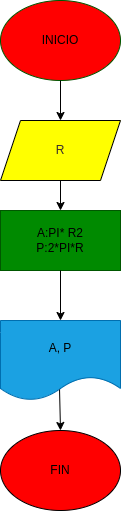

# Ejercicio No. 1
## programa para calcular el area,perimetro de un circulo radio R

# ANALISIS

Variable de entrada (imput)

R: Radio del circulo

Variables de proceso y salida (processing, storage, output)

A:Area del circulo= PI*R2

P: Permetro del circulo=2*PI*R

# DISEÑO

# CONSTRUCCION